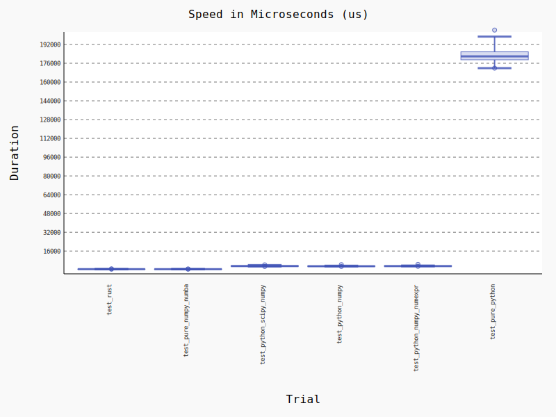
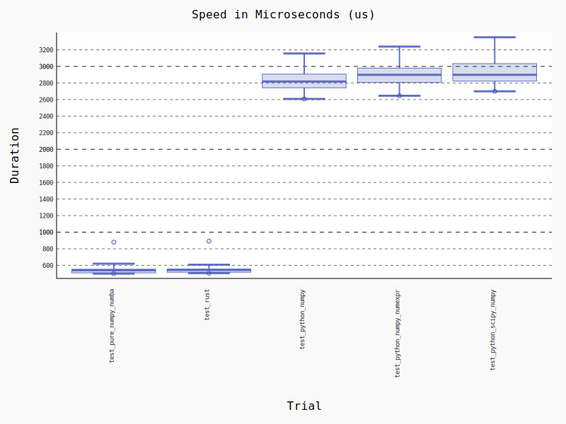

Rust and Python - Data Science Benchmark
===
Testing the performance of Rust and Python on a simple data science task.

Tools and Requirements:
* https://github.com/dgrunwald/rust-cpython
* https://github.com/PyO3/setuptools-rust
* https://docs.rs/crate/pyo3/0.13.1
* brew install gnu-time
* virtualenv
* Python 3.7.4


Importante Sources:
* https://gist.github.com/ssokolow/34ce62a0d98054810c488a7f0d3fd4e0


Running the tests:
```
$ virtualenv env
$ source venv/bin/activate
$ pip install
```

Results:

```
# Python invoking pure Rust
$ gtime python entropy_rust.py
3.00user 0.61system 0:02.01elapsed 180%CPU (0avgtext+0avgdata 60240maxresident)k
0inputs+0outputs (5major+15215minor)pagefaults 0swaps

# Python with Data Science Libraries
$ gtime python entropy_python_data_science.py
5.85user 1.28system 0:05.84elapsed 122%CPU (0avgtext+0avgdata 151744maxresident)k
0inputs+0outputs (2133major+35969minor)pagefaults 0swaps

# Pure Python
$ gtime python entropy_pure_python.py
83.88user 0.95system 1:23.82elapsed 101%CPU (0avgtext+0avgdata 60004maxresident)k
0inputs+0outputs (2129major+13035minor)pagefaults 0swaps
```

Benchmark Tests:
```
$ pytest --benchmark-min-rounds=120 --benchmark-histogram=histogram entropy.py
---------------------------------------------------------------------------------------------------- benchmark: 6 tests ----------------------------------------------------------------------------------------------------
Name (time in us)                      Min                     Max                    Mean                StdDev                  Median                   IQR            Outliers         OPS            Rounds  Iterations
----------------------------------------------------------------------------------------------------------------------------------------------------------------------------------------------------------------------------
test_rust                         542.1070 (1.0)          866.5210 (1.11)         580.0547 (1.02)        43.2468 (1.16)         568.4570 (1.02)         7.0382 (1.0)       121;316  1,723.9754 (0.98)       1333           1
test_pure_numpy_numba             548.9560 (1.01)         783.2350 (1.0)          567.3531 (1.0)         37.2231 (1.0)          554.9335 (1.0)         10.8635 (1.54)         9;13  1,762.5707 (1.0)         120           1
test_python_scipy_numpy         2,832.0430 (5.22)       4,264.0880 (5.44)       3,235.2110 (5.70)       304.5976 (8.18)       3,188.9715 (5.75)       381.0620 (54.14)        34;6    309.0988 (0.18)        146           1
test_python_numpy               2,850.6520 (5.26)       4,423.0050 (5.65)       3,100.2738 (5.46)       197.0626 (5.29)       3,052.7360 (5.50)       190.6520 (27.09)       36;13    322.5522 (0.18)        302           1
test_python_numpy_numexpr       2,967.3900 (5.47)       4,639.2210 (5.92)       3,213.1512 (5.66)       223.0687 (5.99)       3,164.0450 (5.70)       170.1362 (24.17)       18;12    311.2210 (0.18)        229           1
test_pure_python              171,827.4220 (316.96)   204,286.8360 (260.82)   182,864.1219 (322.31)   5,189.4670 (139.42)   181,877.5370 (327.75)   6,761.0355 (960.61)       34;3      5.4685 (0.00)        120           1
----------------------------------------------------------------------------------------------------------------------------------------------------------------------------------------------------------------------------

Legend:
  Outliers: 1 Standard Deviation from Mean; 1.5 IQR (InterQuartile Range) from 1st Quartile and 3rd Quartile.
  OPS: Operations Per Second, computed as 1 / Mean
```




